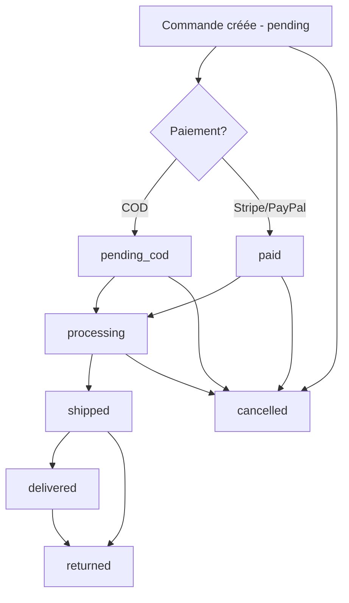

# Order Workflow & Notifications Guide

## Vue d'ensemble

Le système de gestion des commandes implémente un workflow de statuts contrôlé avec transitions validées, permissions basées sur des policies, et notifications email automatiques.

## ORD-01: Workflow Statuts Commande

### Statuts disponibles

- **`pending`** : Commande créée, en attente de paiement
- **`pending_cod`** : Commande COD en attente de confirmation
- **`paid`** : Paiement confirmé
- **`processing`** : Commande en cours de traitement
- **`shipped`** : Commande expédiée
- **`delivered`** : Commande livrée
- **`cancelled`** : Commande annulée
- **`returned`** : Commande retournée

### Transitions autorisées

```
pending → [pending_cod, processing, cancelled]
pending_cod → [processing, cancelled]
paid → [processing, cancelled]
processing → [shipped, cancelled]
shipped → [delivered, returned]
delivered → [returned]
cancelled → []
returned → []
```

### Permissions (OrderPolicy)

#### Voir une commande (`view`)
- ✅ Propriétaire de la commande
- ✅ Administrateur

#### Modifier le statut (`updateStatus`)
- ✅ Administrateur uniquement

#### Annuler une commande (`cancel`)
- ✅ Propriétaire si statut `pending` ou `pending_cod`
- ✅ Administrateur (tous statuts)

### API Endpoints

#### Consulter les transitions autorisées
```http
GET /api/v1/orders/{order_id}/allowed-transitions
Authorization: Bearer {token}
```

**Réponse:**
```json
{
  "current_status": "pending",
  "allowed_transitions": ["pending_cod", "processing", "cancelled"]
}
```

#### Mettre à jour le statut
```http
PATCH /api/v1/orders/{order_id}/status
Authorization: Bearer {token}
Content-Type: application/json

{
  "status": "processing",
  "reason": "Payment confirmed, preparing shipment"
}
```

**Réponse:**
```json
{
  "data": {
    "id": 123,
    "status": "processing",
    "user_id": 1,
    "grand_total": "299.98",
    "currency": "USD",
    "created_at": "2025-12-22T08:00:00.000000Z",
    "updated_at": "2025-12-22T10:30:00.000000Z"
  }
}
```

#### Annuler une commande
```http
POST /api/v1/orders/{order_id}/cancel
Authorization: Bearer {token}
Content-Type: application/json

{
  "reason": "Customer requested cancellation"
}
```

### Logs

Chaque transition de statut est loggée dans le canal `catalogue` :

```json
{
  "order_id": 123,
  "user_id": 1,
  "old_status": "pending",
  "new_status": "processing",
  "reason": "Payment confirmed",
  "timestamp": "2025-12-22T10:30:00+00:00"
}
```

## ORD-02: Notifications Email

### Configuration SMTP

Ajoutez ces variables dans votre fichier `.env` :

```env
# Mailer par défaut (smtp, log, array)
MAIL_MAILER=smtp

# Configuration SMTP
MAIL_HOST=smtp.mailtrap.io
MAIL_PORT=2525
MAIL_USERNAME=your_username
MAIL_PASSWORD=your_password
MAIL_ENCRYPTION=tls

# Adresse d'expédition
MAIL_FROM_ADDRESS=noreply@votresite.com
MAIL_FROM_NAME="${APP_NAME}"
```

### Providers SMTP supportés

#### Mailtrap (développement)
```env
MAIL_HOST=smtp.mailtrap.io
MAIL_PORT=2525
MAIL_USERNAME=your_mailtrap_username
MAIL_PASSWORD=your_mailtrap_password
```

#### Gmail
```env
MAIL_HOST=smtp.gmail.com
MAIL_PORT=587
MAIL_USERNAME=your_email@gmail.com
MAIL_PASSWORD=your_app_password
MAIL_ENCRYPTION=tls
```

#### SendGrid
```env
MAIL_HOST=smtp.sendgrid.net
MAIL_PORT=587
MAIL_USERNAME=apikey
MAIL_PASSWORD=your_sendgrid_api_key
MAIL_ENCRYPTION=tls
```

#### Mailgun
```env
MAIL_HOST=smtp.mailgun.org
MAIL_PORT=587
MAIL_USERNAME=your_mailgun_username
MAIL_PASSWORD=your_mailgun_password
MAIL_ENCRYPTION=tls
```

#### Amazon SES
```env
MAIL_MAILER=ses
AWS_ACCESS_KEY_ID=your_access_key
AWS_SECRET_ACCESS_KEY=your_secret_key
AWS_DEFAULT_REGION=us-east-1
```

### Événements déclenchant des notifications

Les emails sont envoyés automatiquement lors des transitions suivantes :

- **`pending` → `processing`** : "Votre commande est en cours de traitement"
- **`processing` → `shipped`** : "Votre commande a été expédiée"
- **`shipped` → `delivered`** : "Votre commande a été livrée"
- **Toute transition → `cancelled`** : "Votre commande a été annulée"

### Structure de l'email

L'email contient :
- Numéro de commande
- Ancien et nouveau statut
- Montant total
- Date de commande
- Message contextuel selon le statut

### Mode développement (sans SMTP)

Pour tester sans configurer SMTP, utilisez le driver `log` :

```env
MAIL_MAILER=log
```

Les emails seront écrits dans `storage/logs/laravel.log`.

### Queue pour les emails

Les notifications sont envoyées de manière asynchrone via le système de queues Laravel.

Pour traiter les queues en développement :
```bash
php artisan queue:work
```

Pour production, configurez un supervisor ou utilisez Horizon.

## Workflow complet



## Sécurité

- ✅ **Validation backend** : Toutes les transitions sont validées côté serveur
- ✅ **Permissions strictes** : Seuls les admins peuvent modifier les statuts
- ✅ **Logs complets** : Chaque changement est tracé avec user_id et raison
- ✅ **Événements découplés** : Les notifications sont gérées via events/listeners

## Tests

### Tests unitaires
```bash
php artisan test --filter=OrderStatusServiceTest
php artisan test --filter=OrderPolicyTest
```

### Tests d'intégration
```bash
php artisan test --filter=OrderStatusControllerTest
```

### Tester les emails localement

1. Configurer Mailtrap (gratuit) : https://mailtrap.io
2. Copier les credentials dans `.env`
3. Créer une commande et changer son statut
4. Vérifier l'email dans Mailtrap inbox

## Dépannage

### Les emails ne sont pas envoyés

1. Vérifier `MAIL_MAILER` dans `.env`
2. Vérifier les credentials SMTP
3. Consulter `storage/logs/catalogue.log` pour les erreurs
4. Tester la connexion SMTP :
   ```bash
   php artisan tinker
   Mail::raw('Test', fn($msg) => $msg->to('test@example.com')->subject('Test'));
   ```

### Erreur "Connection refused"

- Vérifier que le port SMTP est correct (587 pour TLS, 465 pour SSL)
- Vérifier le firewall
- Vérifier que `MAIL_ENCRYPTION` correspond au port

### Les transitions sont refusées

- Vérifier le statut actuel de la commande
- Consulter les transitions autorisées via l'endpoint `/allowed-transitions`
- Vérifier les permissions de l'utilisateur (admin vs client)

## Extension

### Ajouter un nouveau statut

1. Ajouter le statut dans `OrderStatusService::$allowedTransitions`
2. Définir les transitions autorisées depuis/vers ce statut
3. Mettre à jour le template email si nécessaire
4. Mettre à jour la documentation

### Personnaliser les emails

Les templates sont dans `resources/views/emails/orders/`.

Modifier `status-changed.blade.php` pour personnaliser le design et le contenu.
